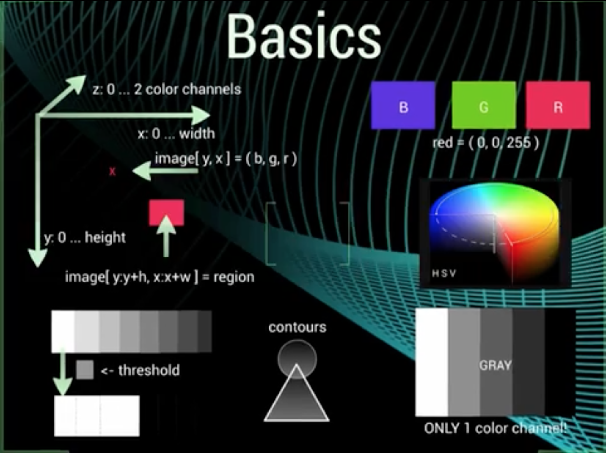
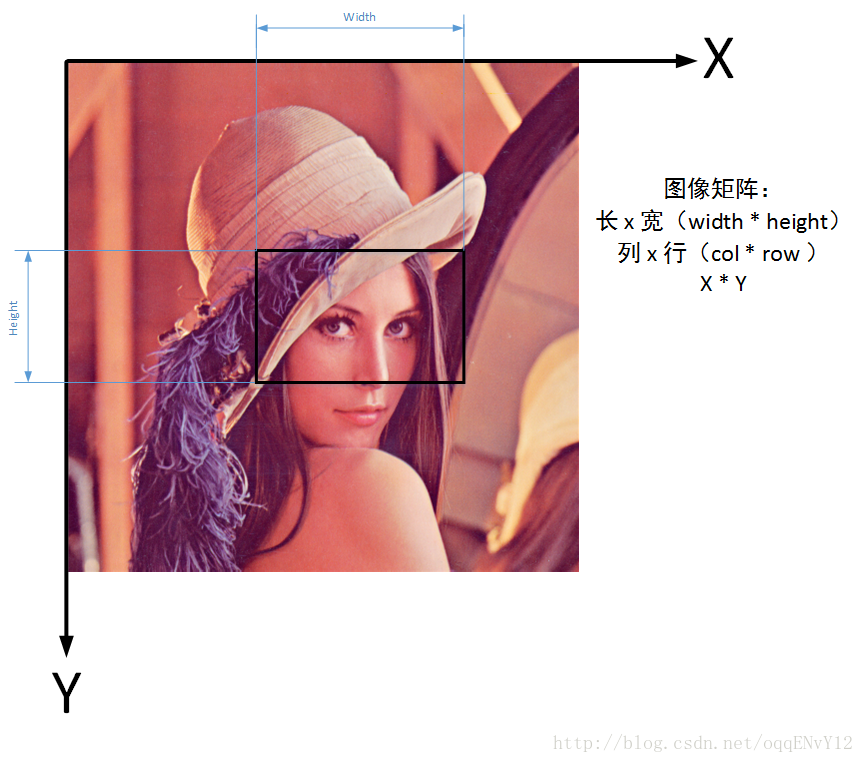

关于图像坐标系与行列宽高的对应关系大致如下:
- row == height == Point.y
- col == width  == Point.x

因为在计算机中，图像是以矩阵的形式保存的。

一张宽度640像素、长度480像素的灰度图保存在一个480 * 640的矩阵中。

## 先行后列

而我们习惯的坐标表示是先X横坐标，再Y纵坐标。
在OpenCV中需要对矩阵进行计算，先行再列。

## 补充（详细解释）

坐标体系中的零点坐标为图片的左上角，X轴为图像矩形的上面那条水平线；Y轴为图像矩形左边的那条垂直线。该坐标体系在诸如结构体Mat,Rect,Point中都是适用的。~~（虽然网上有学着说opencv中有些数据结构的坐标原点是在图片的左下角，但是我暂时还没碰到过）。~~

在使用image.at(x1, x2)来访问图像中点的值的时候，x1并不是图片中对应点的x轴坐标，而是图片中对应点的y坐标。因此其访问的结果其实是访问image图像中的Point(x2, x1)点，即与image.at(Point(x2, x1))效果相同。

如果所画图像是多通道的，比如说image图像的通道数时n，则使用Mat::at(x, y)时，其x的范围依旧是0到image的height，而y的取值范围则是0到image的width乘以n，因为这个时候是有n个通道，所以每个像素需要占有n列。但是如果在同样的情况下，使用Mat::at(point)来访问的话，则这时候可以不用考虑通道的个数，因为你要赋值给获取Mat::at(point)的值时，都不是一个数字，而是一个对应的n维向量。