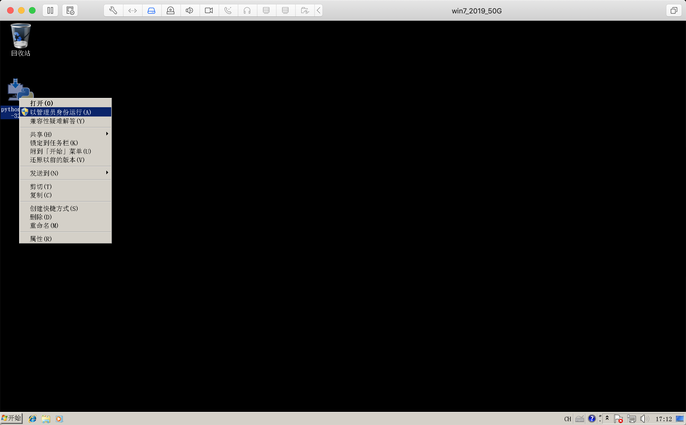
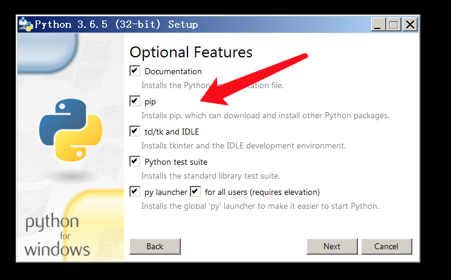
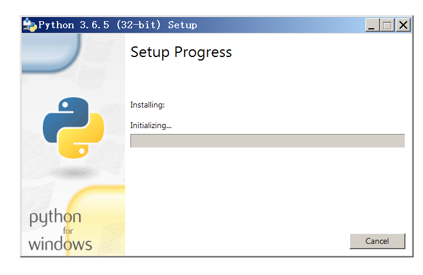
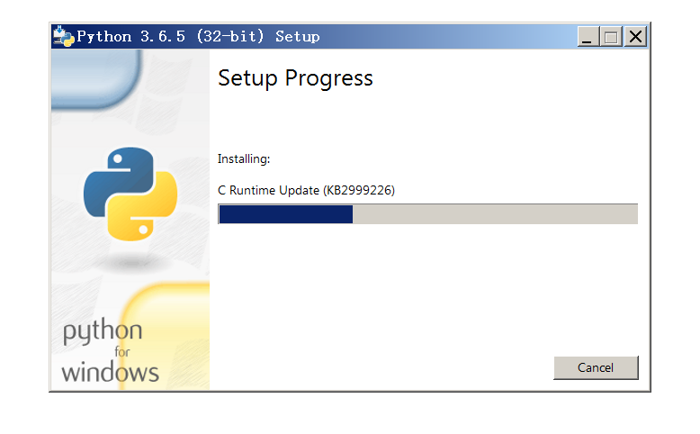
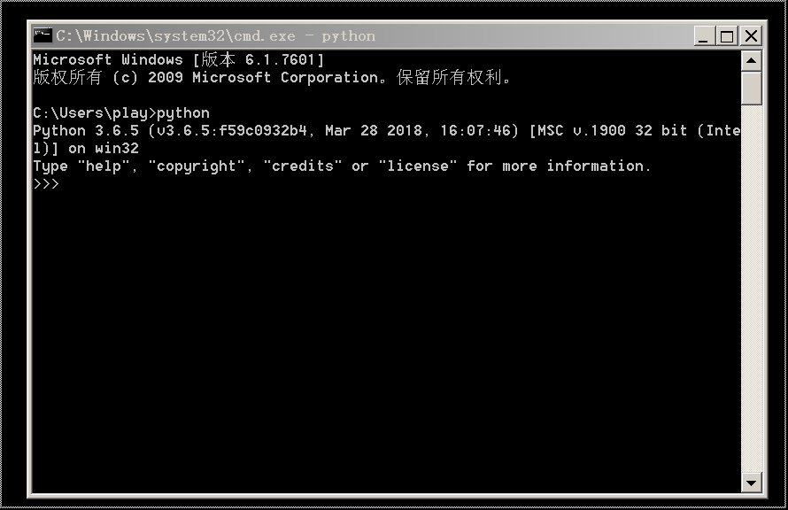
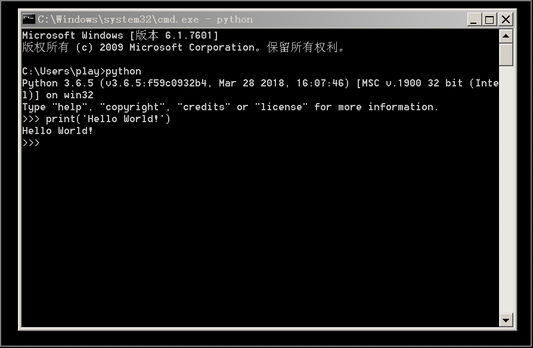
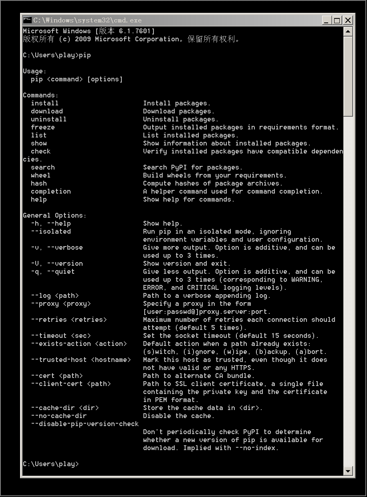
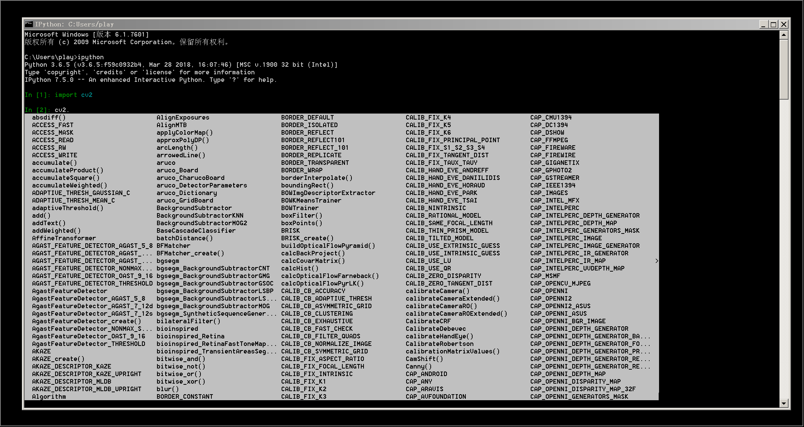
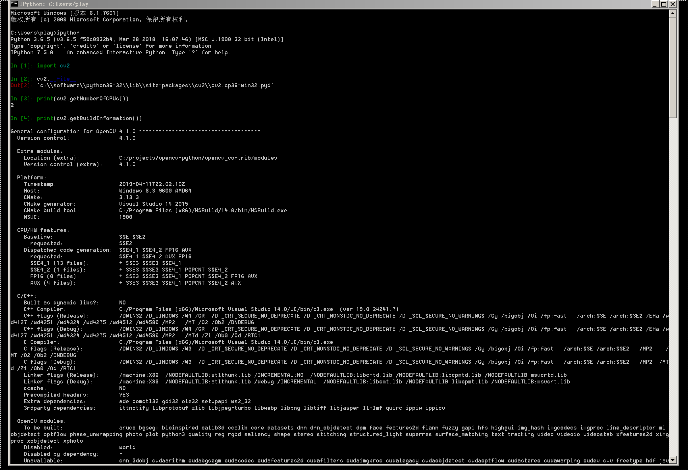

# 在Windows安装Python3.6+pip

- 视频: https://www.bilibili.com/video/av51647039/

- 首先下载Python https://www.python.org/downloads/windows/
- 以管理员运行 
- 
- 
- 
- 
- 
- 
- 
- 
- 
- pip install opencv-contrib-python
    - 
- 
- 