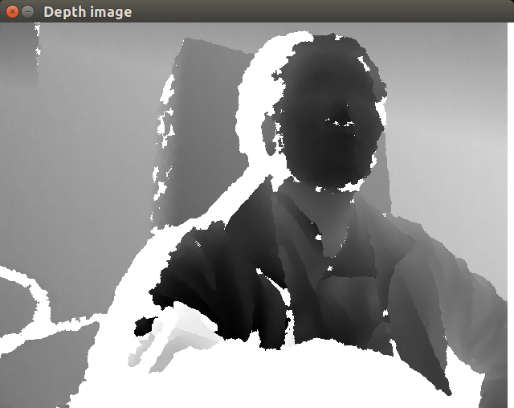

## Xbox-Kinect-深度相机
- 参考
    - [Using Kinect and other OpenNI compatible depth sensors](https://docs.opencv.org/3.0-rc1/d7/df5/tutorial_ug_highgui.html)
    - [Use Kinect with OpenCV (Python)](https://gist.github.com/joinAero/1f76844278f141cea8338d1118423648)
    - [Experimenting with Kinect using opencv, python and open kinect (libfreenect)](https://naman5.wordpress.com/2014/06/24/experimenting-with-kinect-using-opencv-python-and-open-kinect-libfreenect/)
    - [Getting Started With Kinect and OpenCV](https://electronicsforu.com/electronics-projects/software-projects-ideas/getting-started-kinect-opencv)

- 安装驱动
    - sudo apt install python-freenect
    - https://github.com/OpenKinect/libfreenect
    - 不支持python3
        - https://stackoverflow.com/questions/45513567/freenect-not-importing-in-python-3-5-ubuntu-16-04-imports-in-python-2-7
- 必须使用freenect或openni库    
    
- 结果，截图
    