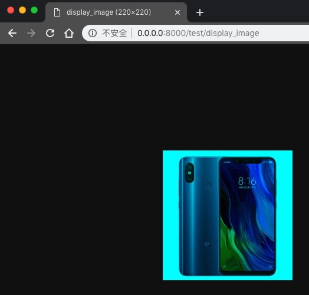

## 在Django里展示图片

- 定义路径
```python
from django.conf.urls import url

from .views import cvtest


urlpatterns = {
    url(r'^display_image$', cvtest.display_image, name='display_image'),

}

```

- 编写视图
```python
from django.http import HttpResponse
import cv2


def display_image(request):
    fn = '/Users/play/Desktop/114311.jpg'
    img = cv2.imread(fn)
    img[:, :, 2] = 0  # 对图片进行处理
    ret, jpeg = cv2.imencode('.jpg', img)
    return HttpResponse(jpeg.tostring(), content_type="multipart/x-mixed-replace")

```
- 在浏览器里访问
    - http://0.0.0.0:8000/test/display_image
    - 
    
- 在网页里引用
    - 
```html
</img>
```    
    